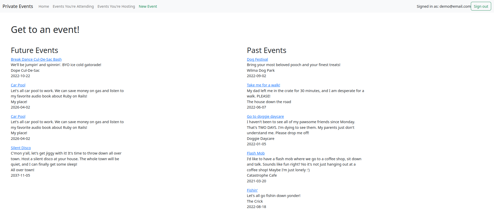
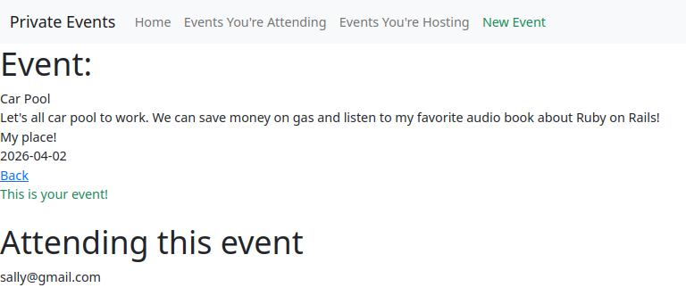
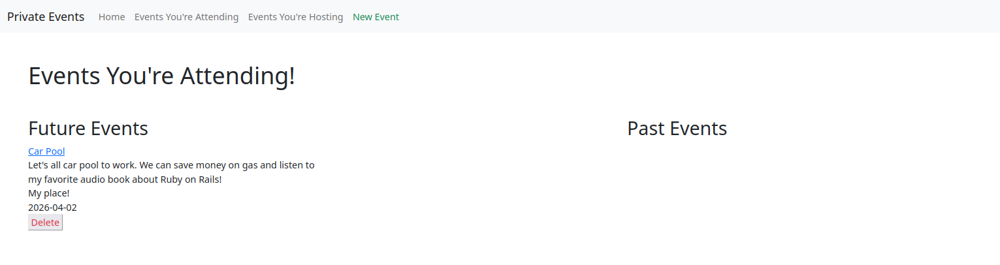
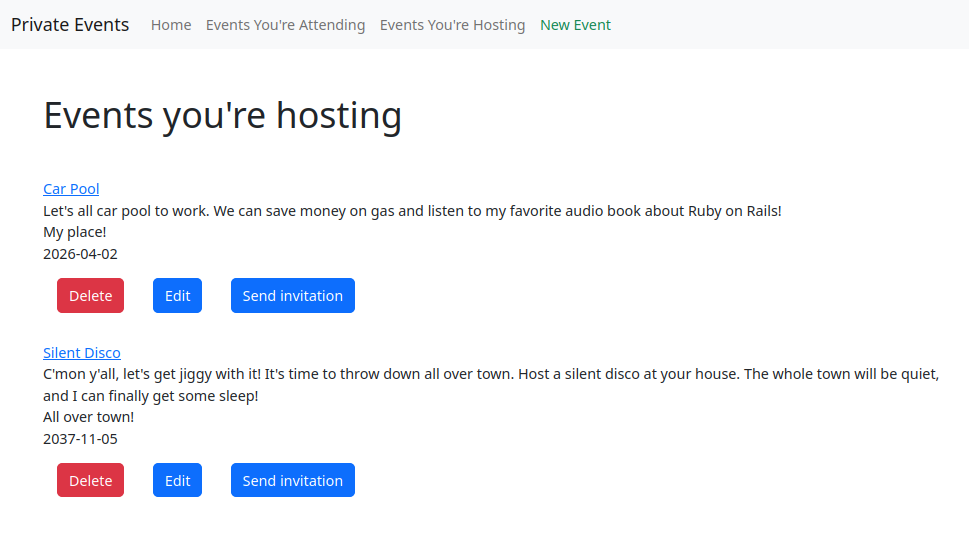
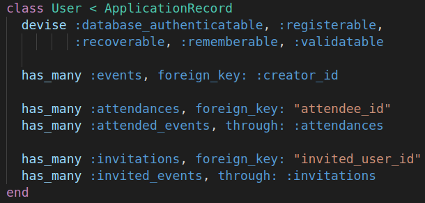
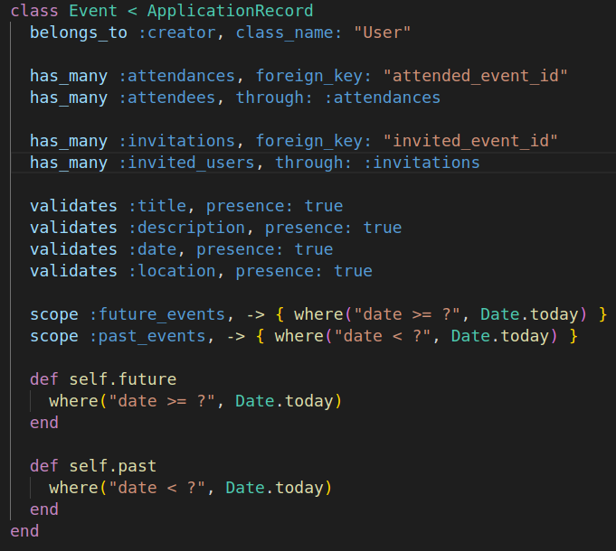
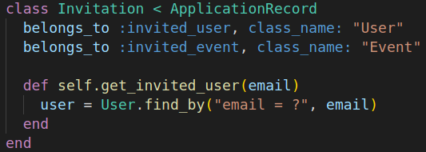
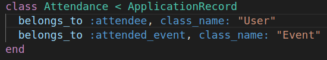

# Private Events

The goal of this project was to practice harder types of model associations.

### Assignment From The Odin Project

"You want to build a site similar to a private [Eventbrite](https://www.eventbrite.com/) which allows users to create events and then manage user signups."

### Functionality

* User can create events
* User can attend many events
* Event can be attended by many users
* User can view the events they've created
* User can view the events they're attending
* User can send and receive invitations
* Uses a has_many through association that allows us to gain access to a user's invitations and an invitation's invitees through a join table called attendances

### Screenshots

  <figure>
    <figcaption>Home Page (events#index)</figcaption>
    
  </figure>
  <figure>
    <figcaption>Event Page</figcaption>
    
  </figure>
  <figure>
    <figcaption>Events You're Attending</figcaption>
    
  </figure>
  <figure>
    <figcaption>Event's You're Hosting</figcaption>
    
  </figure>
  <figure>
    <figcaption>User Model</figcaption>
    
  </figure>
  <figure>
    <figcaption>Event Model</figcaption>
    
  </figure>
  <figure>
    <figcaption>Invitation Model</figcaption>
    
  </figure>
  <figure>
    <figcaption>Attendance Model</figcaption>
    
  </figure>

